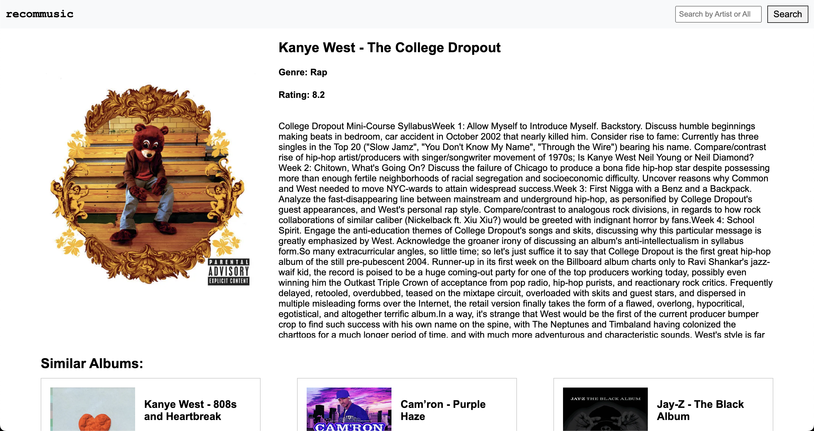

# Music Recommendation Engine

This project is a music recommendation engine that utilizes natural language processing (NLP) techniques to generate music recommendations based on album reviews. The project is built with Python, SQLite, and Flask, and uses a pre-trained model for generating embeddings from the text of music reviews.




## Features

- View album details including artist, album name, year released, rating, review, reviewer, genre, label, and release date.
- Search for albums or artists.
- View recommended albums based on the text of the review.

## How It Works

The recommendation engine works by converting the text of the album reviews into vector embeddings using a pre-trained model. These embeddings are stored in a SQLite database along with other album details.

When a user views an album, the application finds the most similar albums based on the cosine similarity of their review embeddings. The similar albums are then displayed to the user.

## Setup & Installation

1. Clone the repository.

   ```bash
   git clone https://github.com/your-github-username/music-recommendation-engine.git
   ```

2. Navigate to the project directory.

   ```bash
   cd music-recommendation-engine
   ```

3. Install the required packages.

   ```bash
   pip install -U scikit-learn numpy flask
   ```

4. Run the application.

   ```bash
   python web_app
   ```

The application will be accessible at `http://127.0.0.1:5000`.

## License

Distributed under the MIT License. See `LICENSE` for more information.
